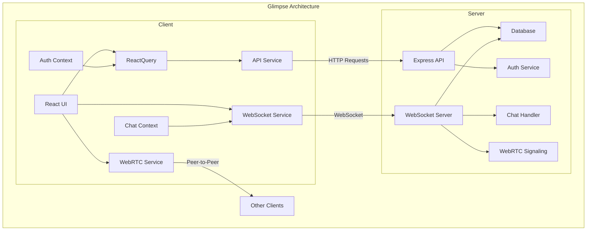

# Glimpse Architecture

## Overview

Glimpse is built using a client-server architecture with the following key components:

1. **Client**: A React/TypeScript application that provides the user interface and handles the WebRTC connections for video conferencing.

2. **Server**: A Node.js/Express application that manages authentication, room data, and acts as a signaling server for WebRTC.

3. **Database**: MongoDB is used to store user profiles, room information, and message history.

## Client Architecture

The client is organized into several main components:

- **React UI**: Provides the user interface components for the application
- **ReactQuery Service**: Manages data fetching and caching
- **WebRTC Service**: Handles peer-to-peer connections for video/audio streaming
- **WebSocket Service**: Manages real-time communication with the server
- **API Service**: Interacts with the server's RESTful API endpoints
- **Auth Context**: Manages authentication state and user profile
- **Chat Context**: Manages real-time chat messaging

## Server Architecture

The server consists of these key components:

- **Express API**: Provides RESTful API endpoints for client requests
- **WebSocket Server**: Handles real-time communication
- **Auth Service**: Manages user authentication and authorization
- **Chat Handler**: Processes chat message events
- **WebRTC Signaling**: Facilitates WebRTC connection establishment
- **Database**: Stores persistent data

## Communication Flow

1. **HTTP Communication**: For typical API requests and responses (auth, room creation, etc.)
2. **WebSocket Communication**: For real-time events (chat messages, user join/leave, etc.)
3. **WebRTC Signaling**: For exchanging connection information between peers
4. **Peer-to-Peer Communication**: Direct media streaming between clients

## Data Flow

1. Client authenticates with the server via HTTP
2. Server returns a JWT token for subsequent requests
3. Client establishes WebSocket connection with the token
4. When joining a room:
   - Server sends room data and participant list
   - WebSocket notifies other participants
   - Each client establishes peer connections with each other
5. Media streams are sent directly between peers
6. Chat messages are sent via WebSocket to the server, which broadcasts to all participants
